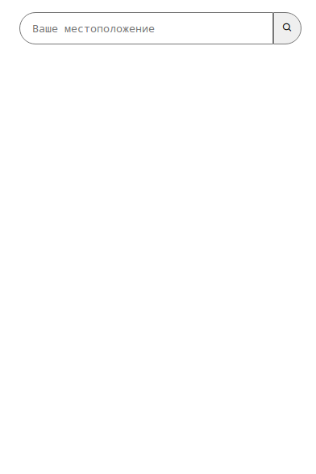
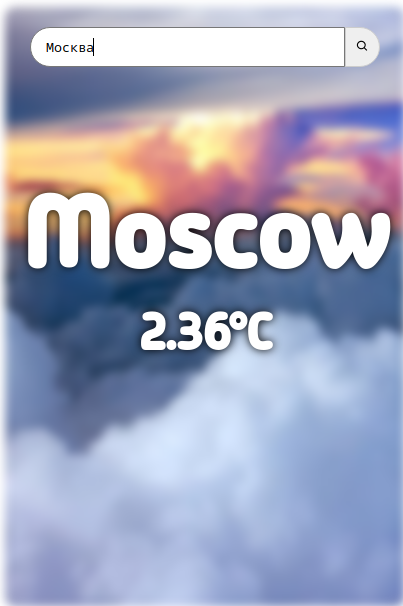
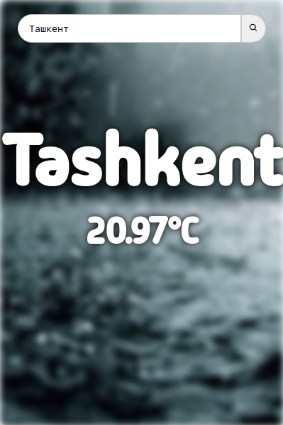
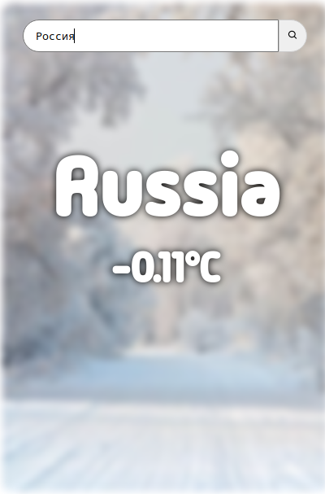

### Погода приложение на Django
## Демо фотографий:






## Запуск
### Установка необходимых библиотек:
```
pip install -r requirements.txt
```
### Вставка Api ключа:
Переходите по пути app/views.py и в 9 строке ставите ваше ключ.
### Запуск отладочного сервера:
```
python3 manage.py runserver
```
Теперь переходите в http://127.0.0.1:8000/ и смотрите результат.
### Развлекайтесь! ⚡️